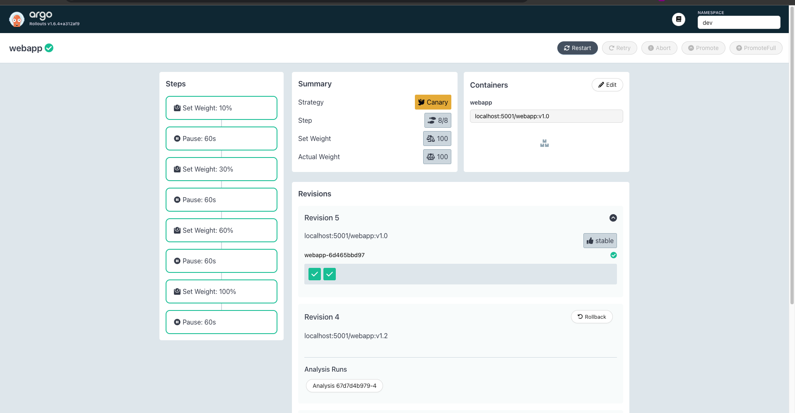
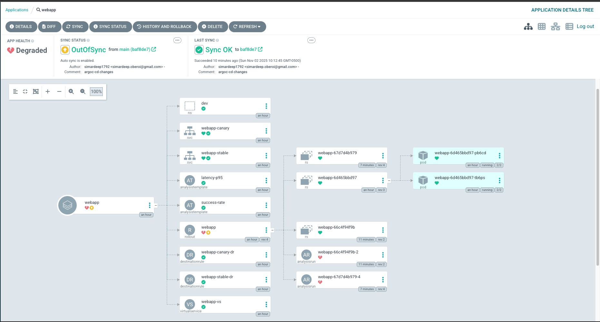

# Progressive Delivery Guardrails

Enterprise-grade proof-of-concept demonstrating automated progressive delivery with SLO-based rollback capabilities using Kubernetes, Istio, and Argo tooling.

## Architecture Overview

[View Interactive Architecture Diagrams](./docs/architecture-mermaid.md)

The system implements a complete progressive delivery pipeline with:

- **GitOps-driven deployment** via Argo CD
- **Automated canary analysis** with Argo Rollouts  
- **Service mesh traffic management** using Istio
- **Real-time SLO monitoring** with Prometheus/Grafana
- **Automated rollback** on SLO breach detection

## Technology Stack

| Component | Technology | Purpose |
|-----------|------------|---------|
| **Orchestration** | Kubernetes (Kind) | Container orchestration and workload management |
| **Service Mesh** | Istio 1.20.1 | Traffic management, security, and observability |
| **GitOps** | Argo CD | Declarative continuous deployment |
| **Progressive Delivery** | Argo Rollouts | Canary deployments and automated analysis |
| **Monitoring** | Prometheus + Grafana | Metrics collection and SLO analysis |
| **Service Graph** | Kiali | Service mesh topology visualization |
| **Container Registry** | Local Registry | localhost:5001 for container images |

## Prerequisites

### Required Software

```bash
# macOS installation
brew install docker kind kubectl helm hey tmux

# Linux installation  
sudo apt-get install docker kind kubectl helm tmux
go install github.com/rakyll/hey@latest

# Argo Rollouts CLI
brew install argoproj/tap/kubectl-argo-rollouts
```

### System Requirements

- Docker Desktop with 8GB+ memory allocation
- Kubernetes 1.25+ compatibility
- Available ports: 8080, 3000, 3100, 8081, 20001

## Quick Start

### Automated Setup (Recommended)

The entire demonstration can be completed in 15 minutes using automated scripts:

```bash
cd progressive-guardrails

# Phase 1: Infrastructure setup (10 minutes)
./run.sh setup

# Phase 2: Dashboard access (30 seconds)  
./run.sh dashboards

# Phase 3: Successful canary demonstration (3 minutes)
./run.sh canary-success

# Phase 4: Auto-rollback demonstration (3 minutes)
./run.sh canary-failure
```

### Manual Setup (Advanced Users)

```bash
# Infrastructure components
make kind-up
make istio-install  
make monitoring-install
make argo-install

# Application deployment
make app-build app-test app-push
make deploy-dev
```

## Canary Deployment Strategy

### Traffic Progression

The system implements a 4-phase canary strategy:

1. **10% Traffic Split** → Pause → Analysis (60s)
2. **30% Traffic Split** → Pause → Analysis (60s)  
3. **60% Traffic Split** → Pause → Analysis (60s)
4. **100% Traffic Split** → Deployment Complete

### SLO-Based Decision Making

**Promotion Criteria (ALL must pass):**
- Success rate ≥ 99% over 1-minute window
- P95 latency ≤ 300ms
- Error rate < 1%

**Rollback Triggers (ANY condition):**
- Success rate < 99%
- P95 latency > 300ms  
- Analysis timeout or failure

## Dashboard Access

### Service URLs

| Service | URL | Credentials |
|---------|-----|-------------|
| **Argo CD** | http://localhost:8080 | admin / [displayed in terminal] |
| **Argo Rollouts** | http://localhost:3100/rollouts/rollout/dev/webapp | No authentication |
| **Grafana** | http://localhost:3000 | admin / admin |
| **Kiali** | http://localhost:20001 | No authentication |
| **Application** | http://webapp.local:8081 | No authentication |

### Screenshots

#### Argo Rollouts Dashboard - Successful Canary
*Screenshot showing traffic progression: 10% → 30% → 60% → 100%*



#### Argo Rollouts Dashboard - Auto-Rollback  
*Screenshot showing automatic rollback when SLOs are breached*



## Operational Commands

### Application Management

```bash
# Build and deploy new version
make app-build IMAGE_TAG=v1.1
make app-push IMAGE_TAG=v1.1  
make canary-start IMAGE_TAG=v1.1

# Monitor rollout progress
make canary-watch

# Manual rollout control
make canary-promote    # Force promotion
make canary-abort      # Abort and rollback
```

### Monitoring and Debugging

```bash
# Check rollout status
kubectl argo rollouts get rollout webapp -n dev

# View analysis results
kubectl get analysisrun -n dev

# Application connectivity test
curl -H "Host: webapp.local" http://localhost:8081/

# System status overview
./run.sh status
```

### Traffic Generation

```bash
# Generate test traffic
make test-canary

# Induce failures for rollback testing
make induce-failure
```

## Validation Criteria

This proof-of-concept demonstrates:

### ✓ CI Gate Enforcement
- Automated testing prevents broken deployments
- Container image validation before registry push
- Kubernetes manifest validation

### ✓ Progressive Traffic Management  
- Gradual traffic shifting with configurable percentages
- Real-time traffic distribution via Istio
- Immediate traffic redirection on failure

### ✓ Automated Decision Making
- SLO-driven promotion decisions
- No manual intervention required
- Consistent, repeatable deployment process

### ✓ SLO-Based Rollback
- Real-time metrics analysis
- Automatic failure detection
- Instant rollback to stable version

### ✓ GitOps Workflow
- Git as single source of truth
- Declarative configuration management
- Audit trail for all changes

### ✓ Comprehensive Observability
- Full-stack monitoring and alerting
- Service mesh traffic visualization
- Real-time SLO dashboards

## Troubleshooting

### Common Issues

**Dashboard Loading Problems:**
```bash
# Verify port-forwards are active
ps aux | grep "kubectl port-forward"

# Restart dashboard access
./run.sh dashboards
```

**Rollout Stuck or Failed:**
```bash
# Check rollout status
kubectl argo rollouts get rollout webapp -n dev

# Clear failed analysis runs
kubectl delete analysisrun -n dev --all

# Reset environment
./run.sh cleanup
```

**Application Connectivity:**
```bash
# Verify hosts file entry
grep webapp.local /etc/hosts

# Test direct connectivity
./run.sh test
```

### Performance Optimization

**Docker Resource Allocation:**
- Ensure Docker Desktop has minimum 8GB memory
- Enable Kubernetes in Docker Desktop settings
- Verify CPU allocation is adequate for workload

**Network Configuration:**
```bash
# Add to /etc/hosts if missing
echo "127.0.0.1 webapp.local" | sudo tee -a /etc/hosts
```

## Cleanup

### Application Reset
```bash
# Reset application only (preserve cluster)
./run.sh cleanup
```

### Complete Environment Removal
```bash
# Remove entire cluster and resources
./run.sh nuke

# Remove hosts entry (optional)
sudo sed -i '' '/webapp.local/d' /etc/hosts
```

## Enterprise Considerations

### Production Deployment

**Security Hardening:**
- Enable Istio mutual TLS
- Implement RBAC policies
- Secure container image scanning

**Scalability:**
- Multi-cluster deployment strategies
- Resource limits and requests
- Horizontal Pod Autoscaling integration

**Monitoring Integration:**
- External Prometheus federation
- Centralized logging with ELK stack
- AlertManager for SLO violations

### Compliance and Governance

**Audit Requirements:**
- Git commit history for change tracking
- Deployment approval workflows
- SLO violation alerting and reporting

**Risk Management:**
- Blast radius limitation
- Rollback time objectives (RTO < 60s)
- Recovery point objectives (RPO = 0)

## Support and Documentation

For detailed operational procedures, see:
- [Progressive Delivery Automation Guide](./TESTING-GUIDE.md)
- [Status Dashboard](./status.html)
- [Architecture Documentation](./docs/)

**Automation Script Reference:**
```bash
./run.sh {setup|dashboards|canary-success|canary-failure|test|status|cleanup|nuke}
```

This implementation provides production-ready patterns for progressive delivery adoption in enterprise Kubernetes environments.