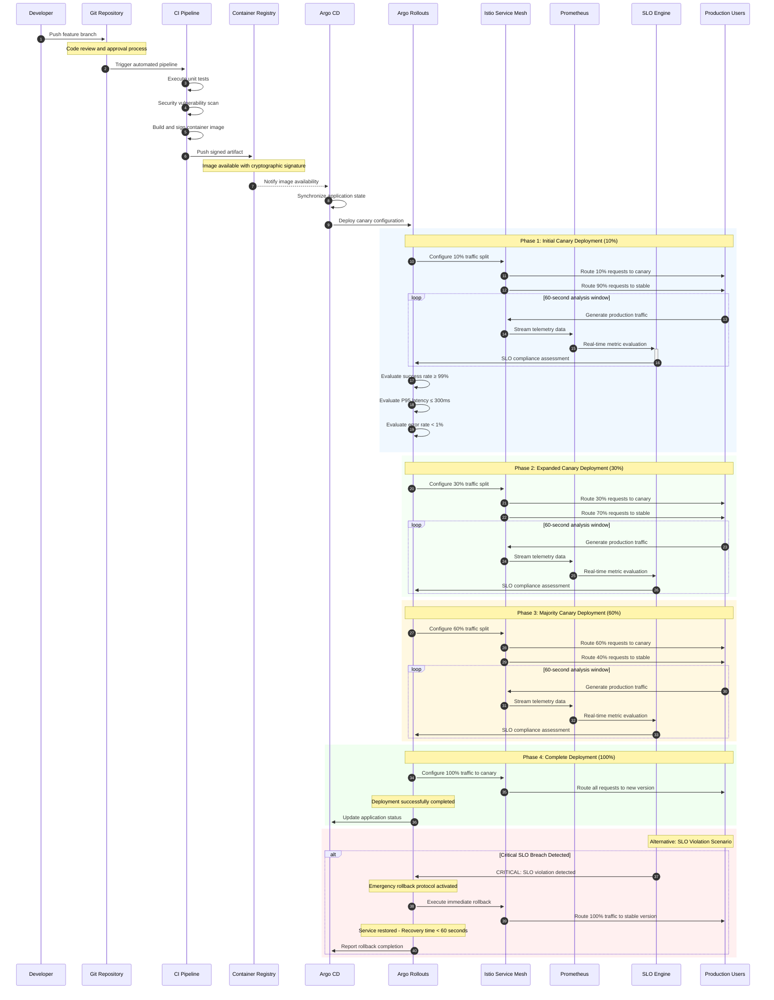
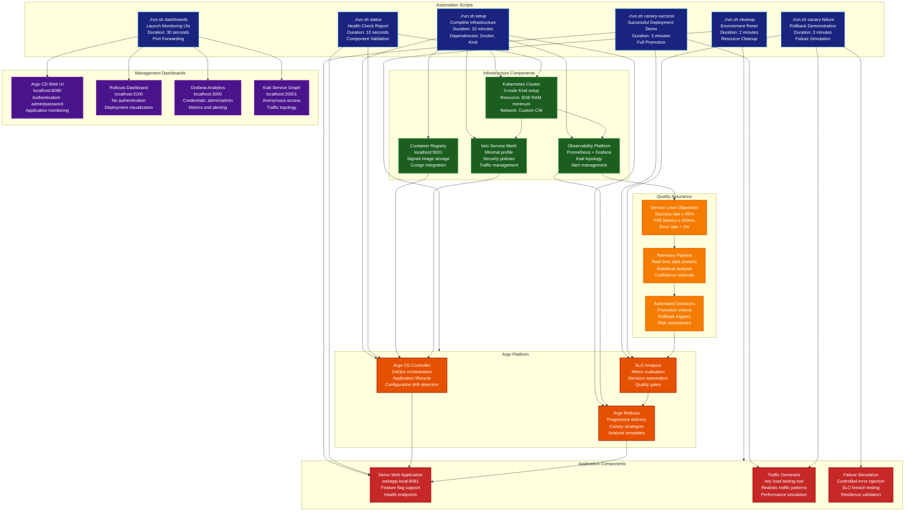
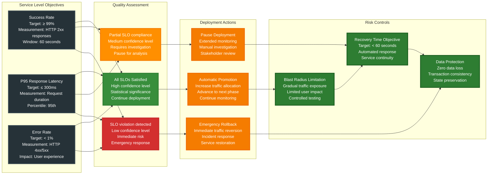

# Enterprise Progressive Delivery Platform

## Production-Ready Architecture

```mermaid
flowchart TB
    subgraph External["External Environment"]
        direction TB
        Dev["Developer Workstation<br/>Feature Development<br/>Code Quality Gates"]
        EndUsers["Production Users<br/>Global Traffic<br/>Multi-Channel Access"]
    end

    subgraph Pipeline["CI/CD Pipeline"]
        direction TB
        GitRepo["Git Repository<br/>Source Control<br/>Branch Protection<br/>Code Review Gates"]
        CISystem["Continuous Integration<br/>Automated Testing<br/>Security Scanning<br/>Image Signing"]
        Registry["Container Registry<br/>localhost:5001<br/>Signed Artifacts<br/>Vulnerability Scanning"]
    end

    subgraph Kubernetes["Kubernetes Platform"]
        direction TB

        subgraph GitOps["GitOps Control Plane"]
            direction LR
            ArgoCD["Argo CD<br/>Port 8080<br/>Declarative Deployment<br/>Application Lifecycle"]
            Rollouts["Argo Rollouts<br/>Port 3100<br/>Progressive Delivery<br/>Canary Management"]
        end

        subgraph ServiceMesh["Service Mesh Layer"]
            direction TB
            Gateway["Istio Gateway<br/>Port 8081<br/>TLS Termination<br/>Security Enforcement"]
            VirtualService["Virtual Service<br/>Traffic Management<br/>Routing Rules<br/>Fault Injection"]
            DestinationRule["Destination Rule<br/>Load Balancing<br/>Circuit Breaking<br/>Connection Pooling"]
        end

        subgraph Applications["Application Workloads"]
            direction LR
            StableApp["Stable Version<br/>webapp:v1.0<br/>Production Traffic<br/>Proven Performance"]
            CanaryApp["Canary Version<br/>webapp:v1.1<br/>Test Traffic<br/>Under Evaluation"]
        end

        subgraph Observability["Observability Platform"]
            direction TB
            Prometheus["Prometheus<br/>Port 9090<br/>Metrics Collection<br/>Time Series Storage"]
            Grafana["Grafana<br/>Port 3000<br/>Visualization<br/>Alert Management"]
            Kiali["Kiali<br/>Port 20001<br/>Service Topology<br/>Traffic Analysis"]
        end

        subgraph Analytics["SLO Analysis Engine"]
            direction TB
            SLOEngine["Real-time Analysis<br/>Success Rate ≥ 99%<br/>P95 Latency ≤ 300ms<br/>Error Rate < 1%<br/>Custom Metrics"]
            DecisionEngine{"Automated Decision<br/>Statistical Analysis<br/>Confidence Intervals<br/>Risk Assessment"}
            PromoteAction["Auto-Promotion<br/>10% → 30% → 60% → 100%<br/>Staged Rollout<br/>Zero Downtime"]
            RollbackAction["Auto-Rollback<br/>Instant Recovery<br/>Blast Radius Control<br/>Service Restoration"]
        end
    end

    %% Primary Data Flow
    Dev -.->|"Feature Branch<br/>Pull Request"| GitRepo
    GitRepo -->|"Webhook Trigger<br/>CI Activation"| CISystem
    CISystem -->|"Build Success<br/>Signed Artifacts"| Registry
    Registry -->|"Image Pull<br/>Deployment Sync"| ArgoCD
    ArgoCD -->|"Manifest Application<br/>Rollout Strategy"| Rollouts

    %% Traffic Management
    EndUsers -->|"HTTPS Requests<br/>Production Load"| Gateway
    Gateway -->|"Intelligent Routing<br/>Security Policies"| VirtualService
    VirtualService -->|"90% Stable Traffic"| StableApp
    VirtualService -->|"10% Canary Traffic"| CanaryApp
    VirtualService -.-> DestinationRule

    %% Service Mesh Configuration
    Rollouts -.->|"Traffic Configuration<br/>Weight Management"| VirtualService

    %% Monitoring and Analytics
    StableApp -->|"Performance Metrics<br/>Business KPIs"| Prometheus
    CanaryApp -->|"Experimental Metrics<br/>Quality Indicators"| Prometheus
    Prometheus -->|"Time Series Data"| Grafana
    Prometheus -->|"Service Mesh Data"| Kiali
    Prometheus -->|"SLO Measurement"| SLOEngine

    %% Decision Flow
    SLOEngine -->|"Analysis Results<br/>Quality Assessment"| DecisionEngine
    DecisionEngine -->|"SLO Compliance<br/>Quality Gate Pass"| PromoteAction
    DecisionEngine -->|"SLO Violation<br/>Quality Gate Fail"| RollbackAction
    PromoteAction -.->|"Traffic Increase<br/>Next Phase"| VirtualService
    RollbackAction -.->|"Immediate Revert<br/>Stable Restoration"| VirtualService

    %% Advanced Styling
    classDef external fill:#263238,stroke:#37474f,stroke-width:3px,color:#ffffff
    classDef pipeline fill:#1565c0,stroke:#0d47a1,stroke-width:3px,color:#ffffff
    classDef gitops fill:#e65100,stroke:#bf360c,stroke-width:3px,color:#ffffff
    classDef mesh fill:#4a148c,stroke:#311b92,stroke-width:3px,color:#ffffff
    classDef app fill:#2e7d32,stroke:#1b5e20,stroke-width:3px,color:#ffffff
    classDef observe fill:#f57c00,stroke:#e65100,stroke-width:3px,color:#ffffff
    classDef analytics fill:#c2185b,stroke:#ad1457,stroke-width:3px,color:#ffffff
    classDef success fill:#388e3c,stroke:#2e7d32,stroke-width:3px,color:#ffffff
    classDef danger fill:#d32f2f,stroke:#c62828,stroke-width:3px,color:#ffffff

    class Dev,EndUsers external
    class GitRepo,CISystem,Registry pipeline
    class ArgoCD,Rollouts gitops
    class Gateway,VirtualService,DestinationRule mesh
    class StableApp,CanaryApp app
    class Prometheus,Grafana,Kiali observe
    class SLOEngine,DecisionEngine analytics
    class PromoteAction success
    class RollbackAction danger
```

## Progressive Traffic Management Sequence

## Operational Automation Matrix

## Risk Mitigation and Decision Matrix

