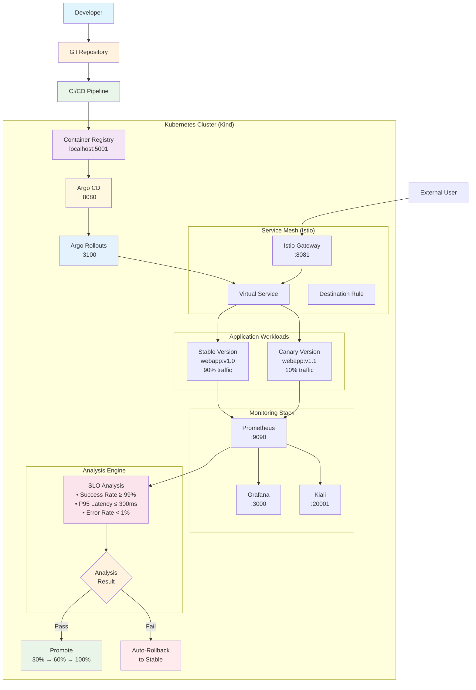
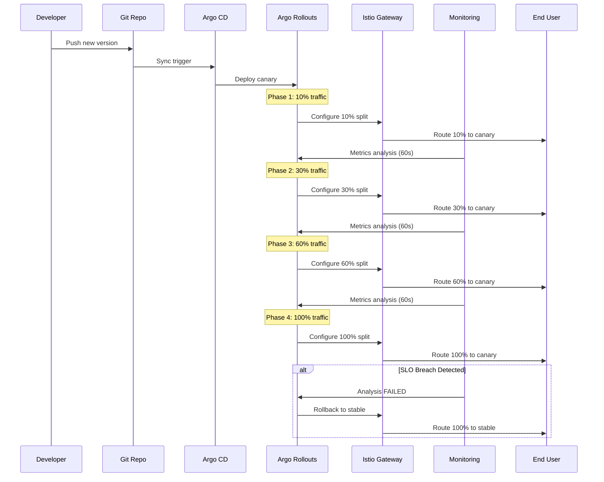
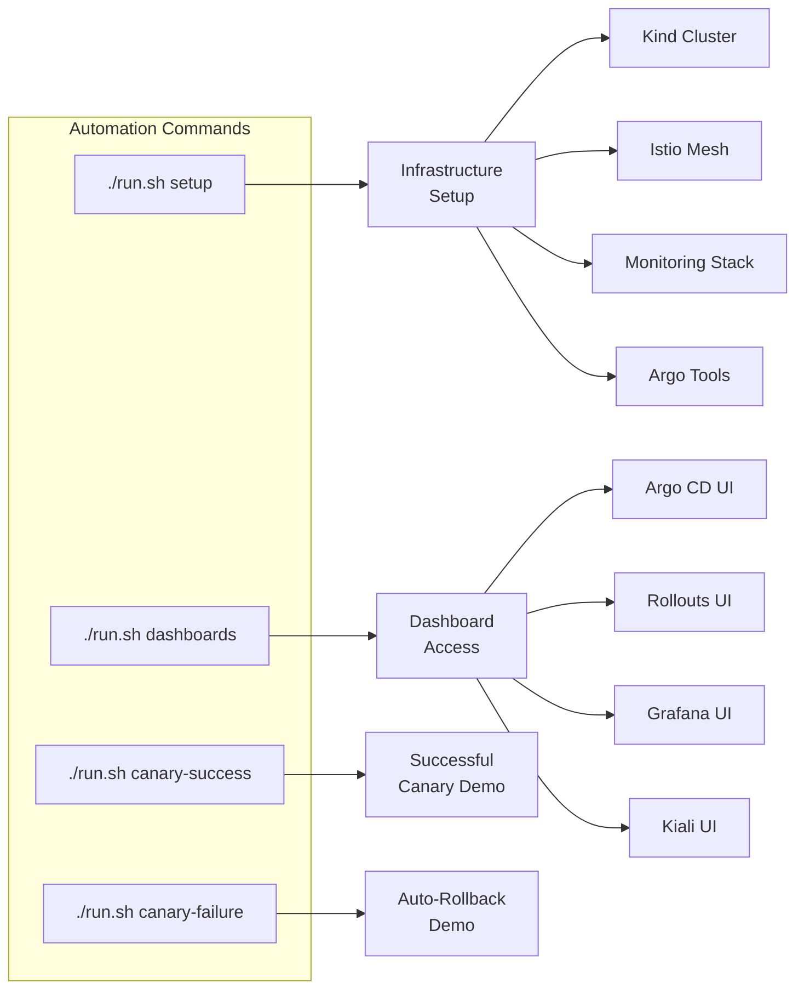

# Progressive Delivery Architecture

```mermaid
graph TB
    Dev[Developer] --> Git[Git Repository]
    Git --> CI[CI/CD Pipeline]
    CI --> Reg[Container Registry<br/>localhost:5001]
    
    subgraph "Kubernetes Cluster (Kind)"
        Reg --> ArgoCD[Argo CD<br/>:8080]
        ArgoCD --> Rollouts[Argo Rollouts<br/>:3100]
        
        subgraph "Service Mesh (Istio)"
            Gateway[Istio Gateway<br/>:8081]
            VS[Virtual Service]
            DR[Destination Rule]
        end
        
        subgraph "Application Workloads"
            Stable[Stable Version<br/>webapp:v1.0<br/>90% traffic]
            Canary[Canary Version<br/>webapp:v1.1<br/>10% traffic]
        end
        
        subgraph "Monitoring Stack"
            Prom[Prometheus<br/>:9090]
            Graf[Grafana<br/>:3000]
            Kiali[Kiali<br/>:20001]
        end
        
        subgraph "Analysis Engine"
            Analysis[SLO Analysis<br/>• Success Rate ≥ 99%<br/>• P95 Latency ≤ 300ms<br/>• Error Rate < 1%]
            Decision{Analysis<br/>Result}
        end
        
        Rollouts --> VS
        VS --> Stable
        VS --> Canary
        
        Stable --> Prom
        Canary --> Prom
        
        Prom --> Analysis
        Analysis --> Decision
        Decision -->|Pass| Promote[Promote<br/>30% → 60% → 100%]
        Decision -->|Fail| Rollback[Auto-Rollback<br/>to Stable]
        
        Gateway --> VS
        
        Prom --> Graf
        Prom --> Kiali
    end
    
    User[External User] --> Gateway
    
    style Dev fill:#e1f5fe
    style Git fill:#fff3e0
    style CI fill:#e8f5e8
    style Reg fill:#f3e5f5
    style ArgoCD fill:#fff8e1
    style Rollouts fill:#e3f2fd
    style Analysis fill:#fce4ec
    style Decision fill:#fff3e0
    style Promote fill:#e8f5e8
    style Rollback fill:#ffebee
```

## Traffic Flow Progression

```mermaid
sequenceDiagram
    participant Dev as Developer
    participant Git as Git Repo
    participant Argo as Argo CD
    participant Roll as Argo Rollouts
    participant Istio as Istio Gateway
    participant Mon as Monitoring
    participant User as End User
    
    Dev->>Git: Push new version
    Git->>Argo: Sync trigger
    Argo->>Roll: Deploy canary
    
    Note over Roll: Phase 1: 10% traffic
    Roll->>Istio: Configure 10% split
    Istio->>User: Route 10% to canary
    Mon->>Roll: Metrics analysis (60s)
    
    Note over Roll: Phase 2: 30% traffic
    Roll->>Istio: Configure 30% split
    Istio->>User: Route 30% to canary
    Mon->>Roll: Metrics analysis (60s)
    
    Note over Roll: Phase 3: 60% traffic
    Roll->>Istio: Configure 60% split
    Istio->>User: Route 60% to canary
    Mon->>Roll: Metrics analysis (60s)
    
    Note over Roll: Phase 4: 100% traffic
    Roll->>Istio: Configure 100% split
    Istio->>User: Route 100% to canary
    
    alt SLO Breach Detected
        Mon->>Roll: Analysis FAILED
        Roll->>Istio: Rollback to stable
        Istio->>User: Route 100% to stable
    end
```

## Component Interaction

```mermaid
graph LR
    subgraph "Automation Commands"
        Setup[./run.sh setup]
        Dash[./run.sh dashboards]
        Success[./run.sh canary-success]
        Failure[./run.sh canary-failure]
    end
    
    Setup --> Infra[Infrastructure<br/>Setup]
    Dash --> UI[Dashboard<br/>Access]
    Success --> Demo1[Successful<br/>Canary Demo]
    Failure --> Demo2[Auto-Rollback<br/>Demo]
    
    Infra --> Kind[Kind Cluster]
    Infra --> Istio[Istio Mesh]
    Infra --> Monitoring[Monitoring Stack]
    Infra --> ArgoTools[Argo Tools]
    
    UI --> ArgoCD[Argo CD UI]
    UI --> Rollouts[Rollouts UI]
    UI --> Grafana[Grafana UI]
    UI --> Kiali[Kiali UI]
```